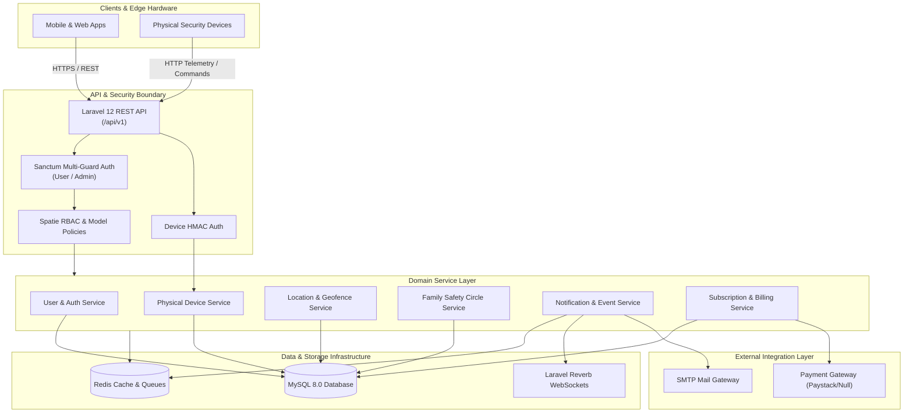

# O SAFE Security API

[](https://php.net)
[](https://laravel.com)
[](#license)

> **O SAFE Security** is a next-generation security and physical device protection SaaS backend platform. It provides real-time physical device monitoring, location tracking, geofencing, automated security alerts, family safety circles, RBAC-protected administrative controls, and subscription billing services.

---

## Overview

O SAFE Security provides a high-reliability RESTful API backend engineered for scalable physical safety networks, personal security hardware, and family protection circles. The architecture leverages Laravel 12, Redis queues, WebSockets (Reverb), Sanctum multi-guard token authentication, Spatie RBAC policies, and a modular payment provider abstraction layer.

---

## Core Capabilities

### 1. Account & Security Authentication
- **Multi-Guard Sanctum Authentication**: Isolated authentication guards for end-users (`user`) and administrative staff (`admin`).
- **Two-Factor Authentication (2FA)**: Email One-Time Passcode (OTP) verification for untrusted device sign-ins.
- **Trusted Device Management**: Device fingerprinting (`user_devices` table) with policy-scoped device authorization.
- **Account Lockout Protection**: Automated account restriction following consecutive failed authentication attempts.

### 2. Physical Device Integration & Telemetry
- **Hardware Integration Layer**: Dedicated endpoints (`/api/v1/device-integration/`) for physical security hardware.
- **Device Provisioning Lifecycle**: Unassigned -> Assigned -> Active -> Suspended -> Deactivated -> Reassigned.
- **Realtime Telemetry Ingestion**: High-frequency processing of battery status, network signal strength, GPS coordinates, and status heartbeats.
- **Command Dispatch & Acknowledgements**: Secure remote command pipeline (e.g., sound alarm, lock device, ping location) with acknowledgment tracking.
- **Device Credential Rotation**: HMAC secret issuance, rotation, and revocation for hardware authentication.

### 3. Location Ingestion & Geofencing Engine
- **Location History Tracking**: GPS coordinate ingestion with spatial accuracy metrics and timestamping.
- **Dynamic Geofence Zones**: Circular and polygon geofence boundary creation with enter/exit event evaluation.
- **Automated Geofence Alerts**: Immediate event generation when a monitored device breaches defined geofence perimeters.

### 4. Family Safety Circles
- **Family Group Management**: Creation and administration of family safety pools with owner controls.
- **Invitation Flow**: Tokenized email invitation system for onboarding family members.
- **Role-Based Access Control**: Granular family roles (`owner`, `admin`, `member`, `child`) dictating device monitoring and emergency control rights.
- **Shared Device Telemetry**: Shared access to family device locations and emergency alerts based on role policies.

### 5. Realtime Events & Notifications
- **WebSocket Broadcasting**: Realtime event dispatch via Laravel Broadcasting (Reverb) over private user and family channels (`private-user.{id}`, `private-family.{id}`).
- **Multi-Channel Dispatch Engine**: Background queue workers delivering in-app notifications, email notifications, and webhook payloads.
- **Notification Preferences & Quiet Hours**: User-configurable delivery channel preferences, category suppressions, and scheduled quiet hours.

### 6. Subscriptions & Billing Engine
- **Plan Management**: Multi-tier subscription plans (Free, Pro Guard, Family Shield) with device and feature limits.
- **Subscription Lifecycle**: Automated handling of activations, renewals, grace periods, suspensions, expirations, and cancellations.
- **Payment Provider Abstraction**: Decoupled payment provider interface (`PaymentProviderInterface`) supporting Paystack and Null driver fallbacks.
- **Webhook Processing**: Cryptographically signed webhook signature verification with Redis-backed idempotency protection.
- **Billing Transaction Audit**: Full ledger recording for transactions, invoice references, and payment method tokens.

### 7. Support & Administration
- **Staff Operations Portal**: Administrative endpoints for managing system health, users, devices, subscription tiers, and audit logs.
- **Support Ticket Desk**: Customer support ticket management with multi-threaded messaging and status resolution.
- **Audit Logging**: Comprehensive system activity logging recording security events, IP addresses, and administrative actions.

---

## Technology Stack

| Layer | Technology | Purpose |
|---|---|---|
| **Framework** | Laravel 12.x | Core Web Application Framework |
| **Language** | PHP 8.2+ | Server-Side Execution |
| **Database** | MySQL 8.0.30+ | Relational Data Storage |
| **Authentication** | Laravel Sanctum 4.x | Token-Based API Authentication |
| **Authorization** | Spatie Laravel Permission 6.x | Role-Based Access Control (RBAC) |
| **Cache & Session** | Redis (predis) | High-Performance Data & Session Cache |
| **Queue System** | Laravel Queues (Redis) | Asynchronous Background Job Processing |
| **Realtime Engine** | Laravel Broadcasting / Reverb | Realtime WebSocket Event Streaming |
| **Mail & Notifications** | Laravel Mail & Notifications | Transactional Email & In-App Alerts |
| **Testing** | PHPUnit 11.x / Laravel Test Suite | Automated Regression & Security Tests |

---

## System Architecture



---

## Security Architecture

O SAFE Security enforces strict defense-in-depth principles:

- **Isolated Authentication Guards**: Administrative staff (`admin`) and end-users (`user`) run on separate, non-overlapping authentication models.
- **Physical Device HMAC Credentials**: Hardware endpoints authenticate using dedicated HMAC-SHA256 signature headers (`X-Device-Signature`, `X-Device-ID`).
- **Policy-Based Authorization**: Every resource endpoint is governed by explicit Laravel Policy classes enforcing strict tenant and user-level data isolation.
- **Trusted Device Fingerprinting**: Sign-in from new browsers or devices requires One-Time Passcode (OTP) verification.
- **Webhook Cryptographic Verification**: Payment webhooks enforce HMAC signature checks (`X-Paystack-Signature`) and Redis idempotency locks.
- **Rate Limiting & Throttling**: Strict request rate limiting on authentication, OTP generation, and telemetry ingestion routes.
- **Encrypted Secrets & Safe Environment**: Sensitive database attributes (tokens, API secrets) are encrypted at rest using AES-256-GCM via `SensitiveFieldEncryption`.

---

## API Architecture & Route Groups

All endpoints are versioned under `/api/v1/`:

```
/api/v1/
├── user/                       (Authenticated User Endpoints)
│   ├── auth/                   (Login, OTP, password reset, logout)
│   ├── user-profile            (Profile fetch & management)
│   ├── devices/                (Assigned device telemetry & remote commands)
│   ├── location/               (Location history, live tracking, geofences)
│   ├── families/               (Family group creation, invitations, members)
│   ├── alerts/                 (Security alert management & resolution)
│   ├── notifications/          (In-app notifications & quiet hours preferences)
│   ├── subscriptions/          (Plan selection, checkout, subscription management)
│   ├── billing/                (Transaction history & payment methods)
│   └── support/                (Support ticket submission & messaging)
│
├── admin/                      (Authenticated Staff Admin Endpoints)
│   ├── auth/                   (Admin login, OTP, password reset)
│   ├── staff/                  (Staff account administration — auth:admin protected)
│   ├── users/                  (User management & status controls)
│   ├── devices/                (Physical device inventory & credential rotation)
│   ├── families/               (System-wide family group oversight)
│   ├── plans/                  (Subscription tier configuration)
│   ├── subscriptions/          (Global subscription administration)
│   ├── support/                (Support ticket resolution desk)
│   ├── system/                 (System health checks & incident management)
│   ├── audit-logs/             (System activity audit log)
│   └── role/                   (RBAC role & permission assignment)
│
├── device-integration/         (Physical Hardware Boundary)
│   ├── heartbeat               (Hardware status pulse)
│   ├── location                (GPS coordinate batch ingestion)
│   ├── battery                 (Battery level telemetry)
│   ├── network                 (Cellular/Wi-Fi telemetry)
│   ├── status                  (Hardware diagnostics)
│   └── commands/               (Remote command fetch & ACK pipeline)
│
├── setup/                      (Public Reference Data)
│   ├── country, state, lga, gender, title, status, means-of-identification
│
└── webhooks/                   (External Service Ingress)
    └── billing                 (Paystack/Provider webhook receiver)
```

---

## Repository Structure

```
o-safe-api/
├── app/
│   ├── Console/                (Artisan scheduled commands)
│   ├── Enums/                  (Domain enums: DeviceStatus, SubscriptionStatus, etc.)
│   ├── Events/                 (Broadcasting & domain events)
│   ├── Exceptions/             (Custom exception handlers & boundary errors)
│   ├── Http/
│   │   ├── Controllers/        (v1 User, Admin, DeviceIntegration, Billing controllers)
│   │   ├── Middleware/         (Sanctum, GlobalApiKey, DeviceAuth, RBAC middleware)
│   │   ├── Requests/           (Form Request validation rules)
│   │   └── Resources/          (API JSON transformation resources)
│   ├── Jobs/                   (Asynchronous queue jobs: logs, notifications, telemetry)
│   ├── Models/                 (Eloquent domain models: User, Device, Family, Geofence, etc.)
│   ├── Notifications/          (User & Admin transactional email notifications)
│   ├── Policies/               (Authorization policies: Device, Family, Subscription, etc.)
│   ├── Providers/              (Service providers & PaymentProvider binding)
│   └── Services/               (Domain service layers: Device, Location, Billing, etc.)
├── bootstrap/                  (Application bootstrapping & routing configuration)
├── config/                     (Laravel application configuration files)
├── database/
│   ├── factories/              (Testing model factories)
│   ├── migrations/             (MySQL relational database migrations)
│   └── seeders/                (Database seeders: RBAC, Plans, Reference Data)
├── docs/                       (Architecture documentation & cleanup reports)
├── public/                     (Application public document root & branding assets)
├── resources/
│   └── views/                  (Blade email templates: auth, account, security, devices, etc.)
├── routes/                     (API routes: api.php, channels.php, console.php)
├── storage/                    (Framework logs, views, and file storage)
└── tests/                      (PHPUnit Feature & Unit test suites)
```

---

## Local Development Setup

### Prerequisites
- PHP 8.2 or higher
- Composer 2.x
- MySQL 8.0+
- Redis 6.x+

### Installation

1. **Clone the repository**:
   ```bash
   git clone https://github.com/<organization>/o-safe-api.git
   cd o-safe-api
   ```

2. **Install PHP dependencies**:
   ```bash
   composer install
   ```

3. **Configure Environment File**:
   ```bash
   cp .env.example .env
   php artisan key:generate
   ```

4. **Configure Database & Services in `.env`**:
   ```ini
   DB_CONNECTION=mysql
   DB_HOST=127.0.0.1
   DB_PORT=3306
   DB_DATABASE=o_safe_db
   DB_USERNAME=root
   DB_PASSWORD=your_secure_password

   REDIS_HOST=127.0.0.1
   REDIS_PORT=6379
   QUEUE_CONNECTION=redis
   CACHE_STORE=redis
   ```

5. **Run Migrations & Seeders**:
   ```bash
   php artisan migrate --seed
   ```

6. **Start Local Development Server**:
   ```bash
   php artisan serve --port=8000
   ```

7. **Start Redis Queue Worker**:
   ```bash
   php artisan queue:work redis --tries=3
   ```

---

## Environment Configuration Parameters

| Variable | Category | Description | Example Placeholder |
|---|---|---|---|
| `APP_NAME` | Application | Application Title | `O SAFE API` |
| `APP_ENV` | Application | Environment Mode | `local` / `production` |
| `APP_KEY` | Application | Application Encryption Key | `base64:...` |
| `APP_API_KEY` | Security | Global API Header Key (`X-API-KEY`) | `random_secret_string` |
| `DB_DATABASE` | Database | MySQL Database Name | `o_safe_db` |
| `REDIS_HOST` | Cache/Queue | Redis Host Address | `127.0.0.1` |
| `QUEUE_CONNECTION` | Queue | Queue Processing Driver | `redis` |
| `BROADCAST_CONNECTION` | Realtime | Event Broadcasting Driver | `reverb` |
| `MAIL_HOST` | Email | SMTP Mail Gateway Host | `smtp.mailtrap.io` |
| `PAYSTACK_SECRET_KEY` | Billing | Paystack Payment Secret Key | `sk_test_...` |

---

## Testing & Quality Assurance

The repository includes a comprehensive automated test suite covering authentication, RBAC, domain policies, physical device telemetry, subscription lifecycles, billing idempotency, and transactional email rendering.

### Execute Automated Test Suite

```bash
# Run all automated tests
php artisan test

# Run focused test suites
php artisan test --filter=EmailTemplateRenderTest
php artisan test --filter=DeviceIntegration
php artisan test --filter=SubscriptionLifecycleTest
php artisan test --filter=Phase2KProductionSecurityTest
```

---

## Production Deployment Checklist

1. **PHP & Extensions**: Ensure PHP 8.2+ with `pdo_mysql`, `redis`, `mbstring`, `openssl`, `bcmath`, and `gd` extensions enabled.
2. **Environment Protection**: Set `APP_ENV=production` and `APP_DEBUG=false`. Ensure `.env` is restricted (`chmod 600`).
3. **Database & Cache Optimization**:
   ```bash
   php artisan config:cache
   php artisan route:cache
   php artisan view:cache
   php artisan migrate --force
   ```
4. **Queue Supervision**: Configure Supervisor or systemd to keep queue workers active (`php artisan queue:work redis --tries=3`).
5. **HTTPS Enforcement**: Ensure TLS/SSL certificates are bound and HTTPS redirection is enforced at web server level (Nginx/Apache).

---

## License

Proprietary — O SAFE Security Platform. All rights reserved.
