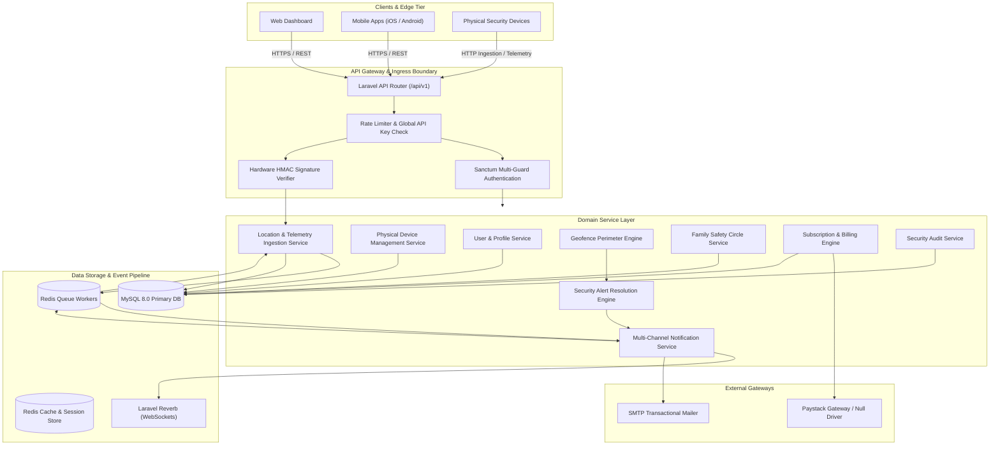
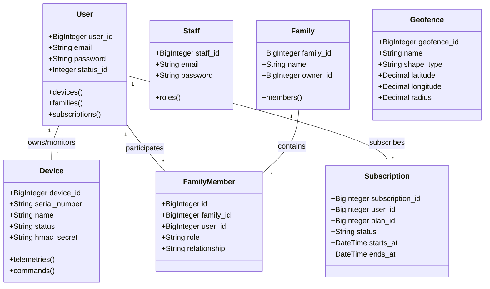
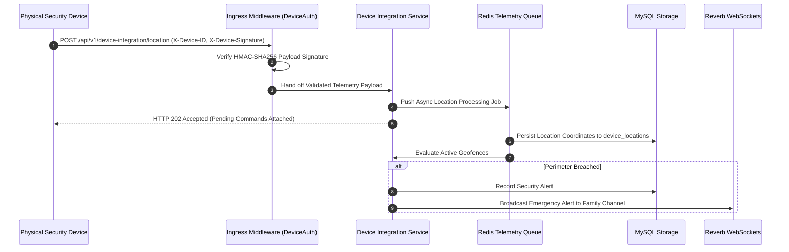
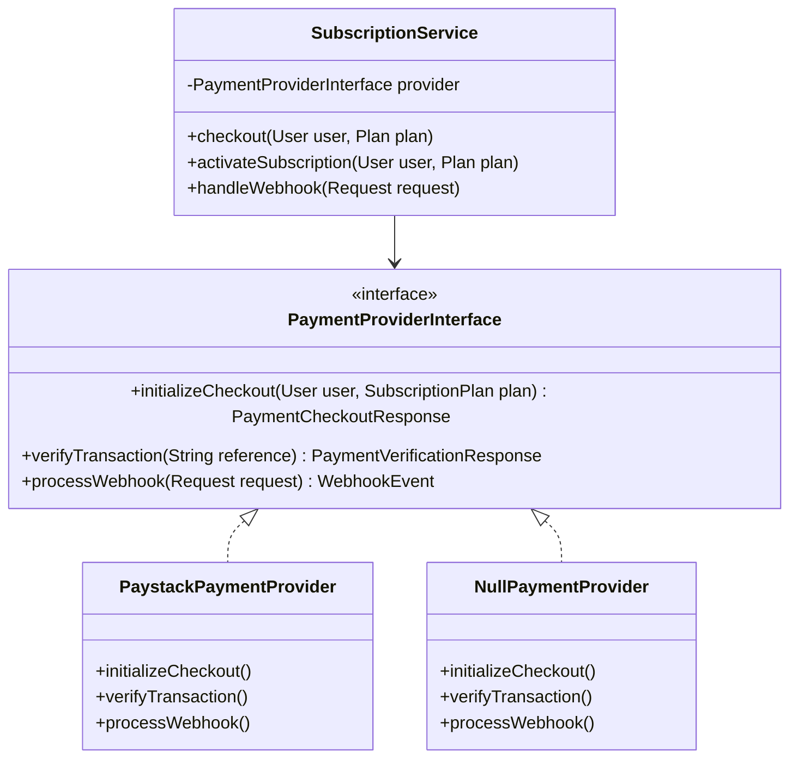
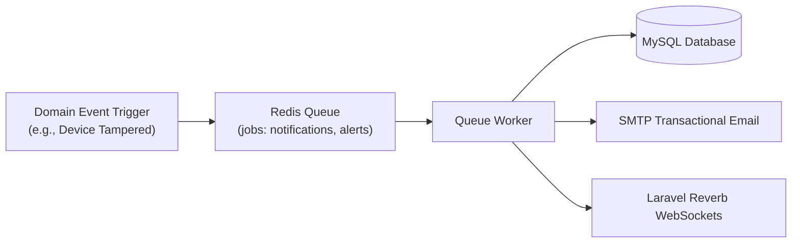

# O SAFE Security — Technical System Architecture Blueprint

## Executive Summary

O SAFE Security is a high-availability, multi-tenant physical security and safety monitoring platform backend. Designed to process continuous device telemetry, manage personal and family protection networks, enforce fine-grained access policies, and handle recurring subscription billing, O SAFE Security provides a secure and scalable foundation for connected safety devices and mobile/web applications.

---

## 1. System Overview & Core Principles

The backend is built on **Laravel 12.x** using a domain-driven, service-oriented RESTful API architecture.

### Key Architectural Principles:
1. **API-First & Headless**: Decoupled backend REST API serving web dashboards, mobile applications, and embedded hardware endpoints.
2. **Multi-Guard Access Isolation**: Complete separation between end-user authentication (`user`) and administrative operations (`admin`).
3. **Hardware Integration Layer**: Dedicated hardware telemetry and command execution pipeline (`/api/v1/device-integration/`) operating under HMAC signature verification.
4. **Policy-Driven Authorization**: Domain policies enforcing user-level and family-level tenant data isolation on every read/write operation.
5. **Event-Driven Asynchronous Processing**: Offloading high-frequency telemetry logging, notification dispatches, and email transmissions to Redis background queues.
6. **Payment Provider Abstraction**: Interface-bound billing engine decoupling domain subscription logic from third-party payment gateways.

---

## 2. High-Level System Architecture

---

## 3. Domain Model & Subsystem Boundaries

The application is structured into clearly separated domain boundaries:

### Key Subsystem Descriptions:

1. **User & Identity Domain**:
   - Manages end-user profiles, security preferences, trusted login devices (`user_devices`), and password credentials.
2. **Staff Administration & RBAC Domain**:
   - Manages administrative staff users (`staff`), Spatie roles, granular permissions, and security incident tracking.
3. **Physical Device Domain**:
   - Handles physical hardware inventory, device assignments (`device_user`), state transitions (`ACTIVE`, `SUSPENDED`, `DEACTIVATED`), HMAC credential issuance, and remote command pipelines (`device_commands`).
4. **Location & Geofencing Domain**:
   - High-throughput location record ingestion (`device_locations`), spatial distance calculations, circular and polygon geofence bounds (`geofences`), and automated perimeter breach evaluations.
5. **Family Safety Circle Domain**:
   - Shared safety pools (`families`), tokenized email invitations (`family_invitations`), membership roles (`owner`, `admin`, `member`, `child`), and family-level device monitoring permissions.
6. **Alerts & Notification Domain**:
   - Emergency alert generation (`alerts`), user-configurable delivery preferences (`notification_preferences`), scheduled quiet hours, and multi-channel dispatch (in-app, email, WebSocket broadcasting).
7. **Subscriptions & Billing Domain**:
   - Tiered plans (`subscription_plans`), subscription lifecycles, billing transaction ledgers (`billing_transactions`), Paystack webhook idempotency, and provider abstraction.

---

## 4. Physical Device Integration Boundary

Physical hardware devices communicate with the backend through a specialized boundary designed for high reliability and security.

### Ingestion Flow:

### Hardware Authentication & Security:
- **Device Identifiers**: Every hardware unit presents a unique `X-Device-ID` header.
- **HMAC Signatures**: Telemetry payloads are signed with the device's assigned secret key (`X-Device-Signature: hmac_sha256(payload, secret)`).
- **Credential Rotation**: Admins can rotate device secret keys dynamically via `/api/v1/admin/devices/{id}/credentials/rotate`.

---

## 5. Subscription & Billing Architecture

The billing subsystem uses an interface-driven design allowing seamless transitions between payment providers.

### Webhook Idempotency & Security Pipeline:
1. **Signature Validation**: Validates the cryptographic header (`X-Paystack-Signature`).
2. **Idempotency Lock**: Acquires an atomic Redis lock on the event ID (`billing:webhook:{event_id}`).
3. **Transaction State Machine**: Verifies that billing transactions transition predictably (`PENDING` -> `SUCCESS` -> `COMPLETED`).
4. **Subscription Period Extension**: Extends subscription validity exactly once per successful payment event.

---

## 6. Realtime & Background Processing Pipeline

High-frequency operations (telemetry, alerts, mail dispatches) execute asynchronously off the HTTP request-response cycle.

---

## 7. Security & Compliance Controls

- **Sanctum Multi-Guard Auth**: Prevents cross-contamination between administrative staff and end-user access tokens.
- **Rate Limiting**: Strict rate limiting on authentication routes (5 requests/min on login, 3 requests/min on OTP generation).
- **IDOR / BOLA Prevention**: All resource controllers resolve models via explicit policy gates (`$this->authorize('view', $device)`).
- **Data Protection**: Encrypted model attributes (`SensitiveFieldEncryption`) for credentials and integration keys.
- **Audit Ledger**: Comprehensive audit logging recording IP address, user agent, action name, and target payload for administrative operations.

---

## 8. Deployment & Infrastructure Guidelines

- **Web Server**: Nginx / Apache forwarding to PHP-FPM 8.2+.
- **Database Engine**: MySQL 8.0.30+ with InnoDB engine and UTF8MB4 collation.
- **Caching & Queues**: Redis instance configured with `predis` driver.
- **Process Supervisor**: Supervisor monitoring background queue workers (`php artisan queue:work redis --tries=3`).
- **WebSocket Gateway**: Laravel Reverb daemon bound to internal port 8080 with reverse-proxy SSL termination.
